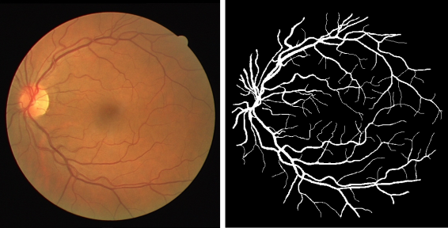
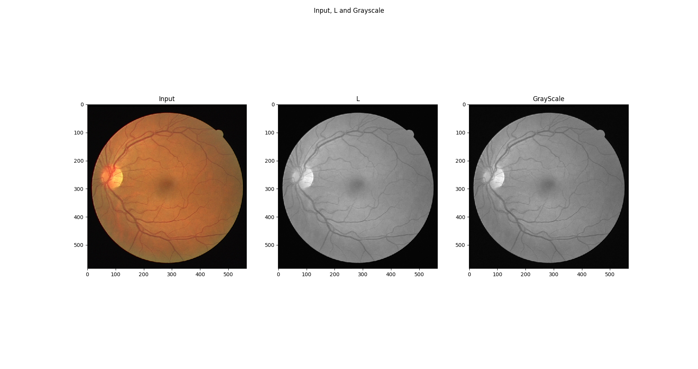
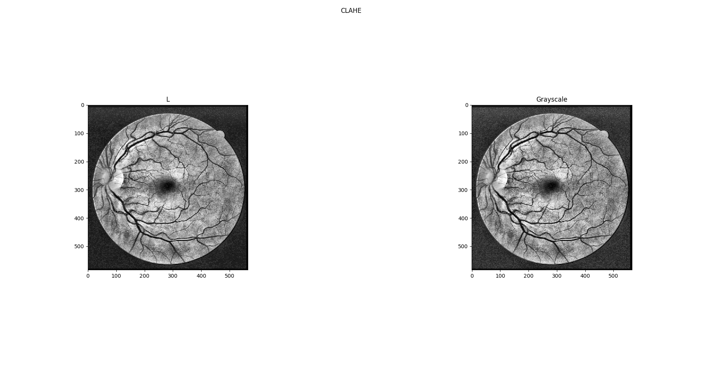
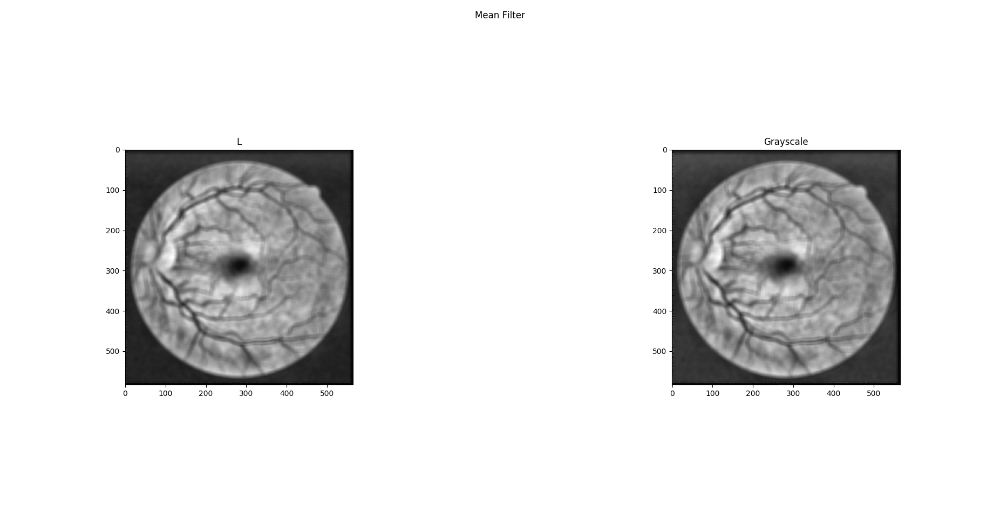
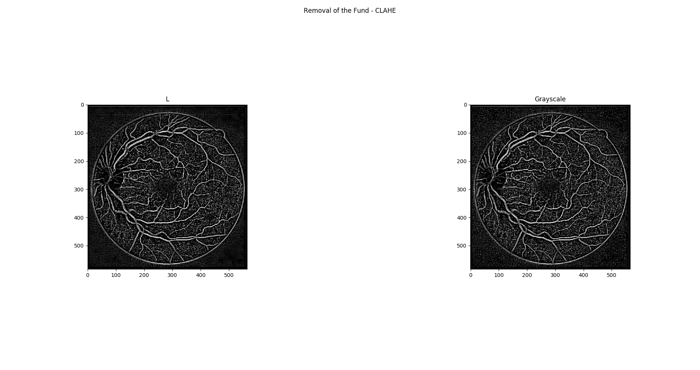
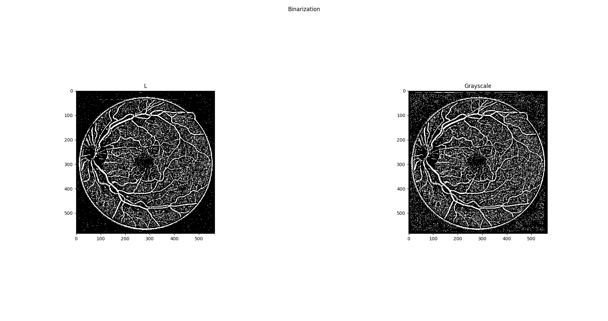
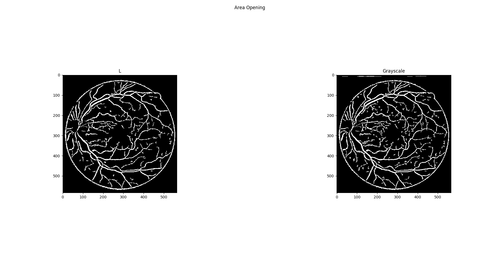
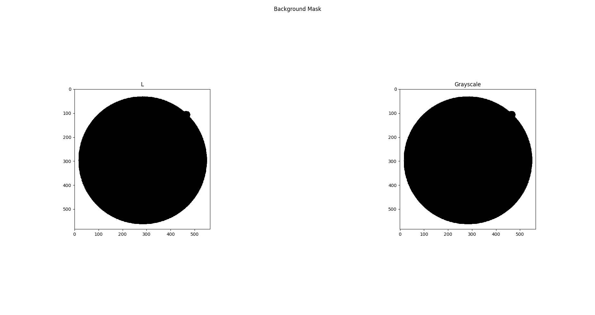
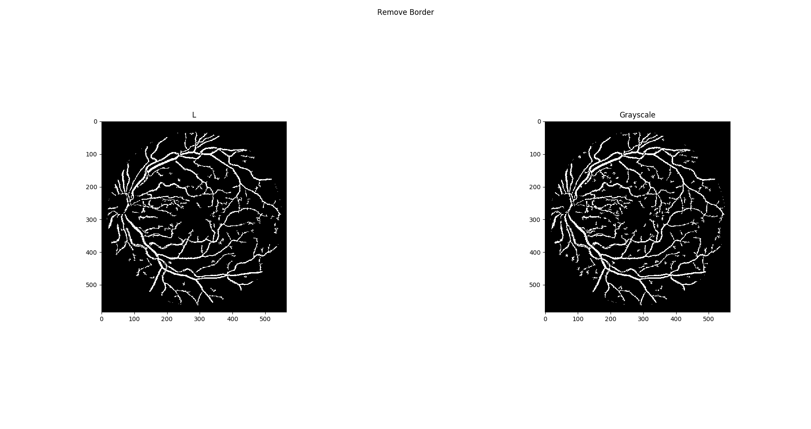
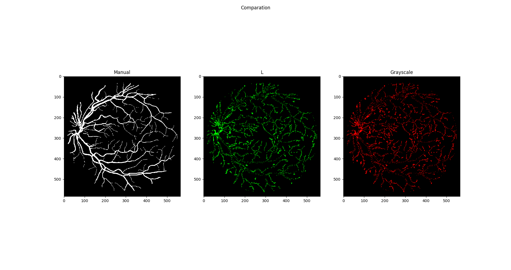

Image Processing Class (SCC5830) - Final Project (06/2019)

Student: João Victor de Oliveira Novaes

#USP: 11360632
 
This project consists of developing an algorithm to segment blood vessels into retinal images. The idea is to combine techniques of image restoration and image segmentation, remove possible noises from the images and subtract the blood vessels. Images of the fundus of the eye (retina) can be used to discover diseases such as diabetes, hypertension and other cardiovascular diseases. In addition, some studies point out that the detection of blood vessels can help analyze the vascular health of the entire body of the patient.  This work will use the Drive database (https://www.isi.uu.nl/Research/Databases/DRIVE/), this database provides a set of 40 images, and for each of these images, there is another image where the blood vessels were manually extracted.

The main objective of this work is to try to replicate the results of the [Soares (2006)](http://www.teses.usp.br/teses/disponiveis/45/45134/tde-24072007-174800/en.php), [Saleh et al. (2011)](https://www.ncbi.nlm.nih.gov/pmc/articles/PMC3138933/) and [Santos et al.(2017)](./1019.pdf)

An example of a database image:

 

### Description ###

**1. Selecting Color Channels**
The literature works using two color channels: the RGB G and the CIELAB L. Neste trabalho, foram utilizados o canal L CIELAB e a imagem em escala de cinza. Para gerar a imagem em escala de cinza, foi utilizada a seguinte equação: grayscale image = ( (0.299 * R) + (0.587 * G) + (0.114 * B)). 

**2. Contrast Adjustment and Noise Removal**
In this step, an adjustment will be made in the contrast of the image in order to highlight the vessels blood, in relation to the background of the image and possible noise. From this, the background and possible noises can be removed. To adjust the contrast was used:

* Contrast Limited adaptive histogram equalization (CLAHE): This operation, part of the idea that a good image has occurrences of all (or something close to it) the possible colors (0-255). Therefore, in order to generate a better one, one can stretch the limits of the color histogram of the image, in this way, it increases the chance of other colors than those present in the original image to appear. Generally, stretching the histogram improves the contrast of the image. However, applying this operation to the whole image does not always yield the best results, in some cases, splitting the image into smaller regions and applying histogram equalization may be better. For more information [click here](https://docs.opencv.org/3.1.0/d5/daf/tutorial_py_histogram_equalization.html).    

**3. Removal of the Fund**
To evidence blood vessels, Saleh et al. (2011) propose to remove the background of the image, in this case, the idea is to remove the pixels with low frequency, leaving only those of high frequency. Saleh et al. (2011) use a strategy to find the average value of a set of neighbors to form a region that can be removed from the original image. For this, a Mean Filter was used in regions[13 13] of the image.

Subtracting from the result of the Mean Filter the CLAHE image:

As some parts of the image are too dark, the CLAHE has been applied again.
 

**4. Binarization**
After using all the methods described above, a binarization of the image will be done, where it is expected to separate the vessels of the other objects of the image. Thus, the vessels will have value 1 (white), while the other regions will be 0 (black). In order to define the threshold used in binarization, the Otsu algorithm will be used to determine the threshold according to the variance between classes.

**4. Morphological Operators**
After applying binarization using the Otsu algorithm, some noises may be present in the image. To remove this noise was used morphological operator of Area Opening or Removal of small objects. This operator converts to zero all the pixels that are part of any region with less than k pixels.

**5. Results**
The results obtained by the developed algorithm will be compared to the manual extraction. Before comparing the generated images with that of manual extraction it is necessary to remove the border, which separates where the retina begins and the black background of the image. For this, a background mask was generated, which, when subtracted from the previous image, removes the edge or decreases its presence.

After removing the border to the image it looks like this:

By comparing the pixels of the image with manual segmentation, with the generated images, the green and red pixels indicate where the applied method was wrong in relation to the segmented image.

### Code ###

To see the code [click here](./Init.py). To execute the code, please install the [dependencies](./requirements.txt). 

The code waits as input for the path to input image.

### References ###

1. **DRIVE Dataset Reference**: Staal, J., Abràmoff, M. D., Niemeijer, M., Viergever, M. A., and Van Ginneken, B. (2004). Ridge-based vessel segmentation in color images of the retina. IEEE transactions on medical imaging, 23(4):501–509.

2. Santos, Breno Peixoto dos; NOVAES,João Victor de Oliveira; BARROS, Wagner Ferreira. Identificação de vaos sanguíneos em imagens da retina In: ENCONTRO NACIONAL DE MODELAGEM COMPUTACIONAL E VIII ECTM – ENCONTRO DE CIÊNCIAS E TECNOLOGIA DE MATERIAIS, 2017, Nova Friburgo, RJ. Anais do XX ENMC – Encontro Nacional de Modelagem Computacional e VIII ECTM – Encontro de Ciências e Tecnologia de Materiais. Nova Friburgo, RJ, 2017.

3. SALEH, Marwan D.; ESWARAN, Chikkannan; MUEEN, Ahmed. An automated blood vessel segmentation algorithm using histogram equalization and automatic threshold selection. Journal of digital imaging, v. 24, n. 4, p. 564-572, 2011.

4. SOARES, João Vitor Baldini. Segmentação de vasos sangüíneos em imagens de retina usando wavelets e classificadores estatísticos. 2006. Tese de Doutorado. Universidade de São Paulo.

