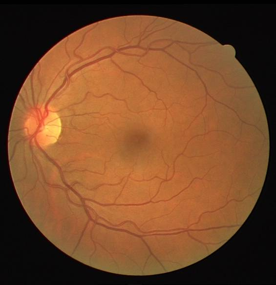

Image Processing Class (SCC5830) - Final Project

Student: João Victor de Oliveira Novaes

#USP: 11360632

Este projeto consiste em desenvolver um algoritmo para segmentar vasos sanguineos em imagens de retina. A ideia é combinar técnicas de image restoration and image segmentation, para remover possiveis ruidos das imagens e então subtrair os vasos saguineos. Neste trabalho ser utilizada a base de dados Drive (https://www.isi.uu.nl/Research/Databases/DRIVE/) 

**DRIVE Dataset**; Staal, J., Abràmoff, M. D., Niemeijer, M., Viergever, M. A., and Van Ginneken, B. (2004). Ridge-based
vessel segmentation in color images of the retina. IEEE transactions on medical imaging, 23(4):501–
509.
