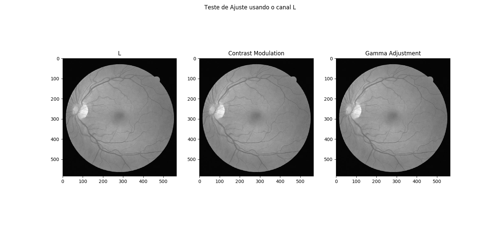
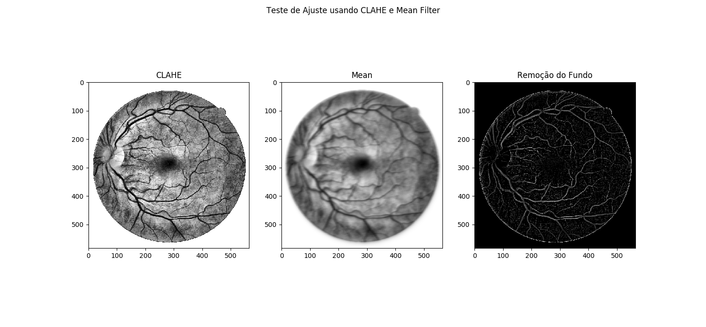
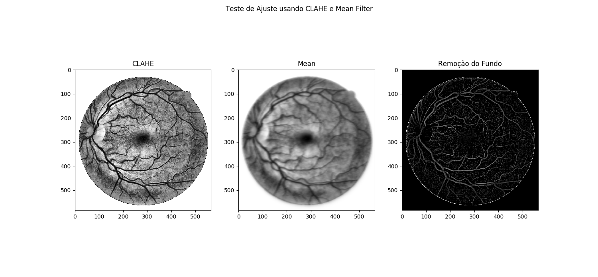

Image Processing Class (SCC5830) - Final Project (05/2019)

Student: João Victor de Oliveira Novaes

#USP: 11360632
 
This project consists of developing an algorithm to segment blood vessels into retinal images. The idea is to combine techniques of image restoration and image segmentation, remove possible noises from the images and subtract the blood vessels. Images of the fundus of the eye (retina) can be used to discover diseases such as diabetes, hypertension and other cardiovascular diseases. In addition, some studies point out that the detection of blood vessels can help analyze the vascular health of the entire body of the patient.  This work will use the Drive database (https://www.isi.uu.nl/Research/Databases/DRIVE/), this database provides a set of 40 images, and for each of these images, there is another image where the blood vessels were manually extracted.

The main objective of this work is to try to replicate the results of the [Soares (2006)](http://www.teses.usp.br/teses/disponiveis/45/45134/tde-24072007-174800/en.php), [Saleh et al. (2011)](https://www.ncbi.nlm.nih.gov/pmc/articles/PMC3138933/) and [Santos et al.(2017)](./1019.pdf)

An example of a database image:

### Steps ###
**1. Selecting Color Channels**
The literature works using two color channels: the RGB G and the CIELAB L. Initially, the two channels will be used in order to verify which of them best fit this work.

**2. Contrast Adjustment and Noise Removal**
In this step, an adjustment will be made in the contrast of the image in order to highlight the vessels blood, in relation to the background of the image and possible noise. From this, the background and possible noises can be removed. For the contrast adjustment it is planned to test:
* Contrast Limited adaptive histogram equalization (CLAHE)
* Wavelet de Gabor 2D
* Contrast modulation and/or Gamma adjustment

**3. Removal of the Fund**
To evidence blood vessels, Saleh et al. (2011) propose to remove the background of the image, in this case, the idea is to remove the pixels with low frequency, leaving only those of high frequency. Saleh et al. (2011) use a strategy to find the average value of a set of neighbors to form a region that can be removed from the original image.

**4. Binarization**
After using all the methods described above, a binarization of the image will be done, where it is expected to separate the vessels of the other objects of the image. Thus, the vessels will have value 1 (white), while the other regions will be 0 (black). In order to define the threshold used in binarization, the Otsu algorithm will be used to determine the threshold according to the variance between classes (0 and 1).

**4. Morphological Operators and Other Methods**
During each of the steps described, the possibility of using some other method of the literature will be evaluated. In addition, Santos et al. (2017) showed that using some morphological operators (erosion, dilation, and aperture) can improve the results obtained during binarization.

**5. Results**
The results obtained by the developed algorithm will be compared to the manual extraction and the works of the literature.

### Partial Code ###

To view the partial code [click here](./Init.py). To execute the code, please install the [dependencies](./requirements.txt). 

The Images [AjusteL](./AjusteL.png) and [AjusteL2](./AjusteL2.png), show the initial results using the L channel. In an analogous way the images [AjusteG](./AjusteG.png) and [AjusteG2](./AjusteG2.png), show the initial results using the G channel.

So far, the CLAHE algorithm and Mean Filter have been used to adjust the contrast and remove the background of the image. The next steps are:

1. Test other adjustment functions and filters.
2. Apply the binarization using the Otsu method.
3. Test the application of morphological operators.

### Images ###

Partial L channel.

Partial G channel.

### References ###

1. **DRIVE Dataset Reference**: Staal, J., Abràmoff, M. D., Niemeijer, M., Viergever, M. A., and Van Ginneken, B. (2004). Ridge-based vessel segmentation in color images of the retina. IEEE transactions on medical imaging, 23(4):501–509.

2. Santos, Breno Peixoto dos; NOVAES,João Victor de Oliveira; BARROS, Wagner Ferreira. Identificação de vaos sanguíneos em imagens da retina In: ENCONTRO NACIONAL DE MODELAGEM COMPUTACIONAL E VIII ECTM – ENCONTRO DE CIÊNCIAS E TECNOLOGIA DE MATERIAIS, 2017, Nova Friburgo, RJ. Anais do XX ENMC – Encontro Nacional de Modelagem Computacional e VIII ECTM – Encontro de Ciências e Tecnologia de Materiais. Nova Friburgo, RJ, 2017.

3. SALEH, Marwan D.; ESWARAN, Chikkannan; MUEEN, Ahmed. An automated blood vessel segmentation algorithm using histogram equalization and automatic threshold selection. Journal of digital imaging, v. 24, n. 4, p. 564-572, 2011.

4. SOARES, João Vitor Baldini. Segmentação de vasos sangüíneos em imagens de retina usando wavelets e classificadores estatísticos. 2006. Tese de Doutorado. Universidade de São Paulo.

